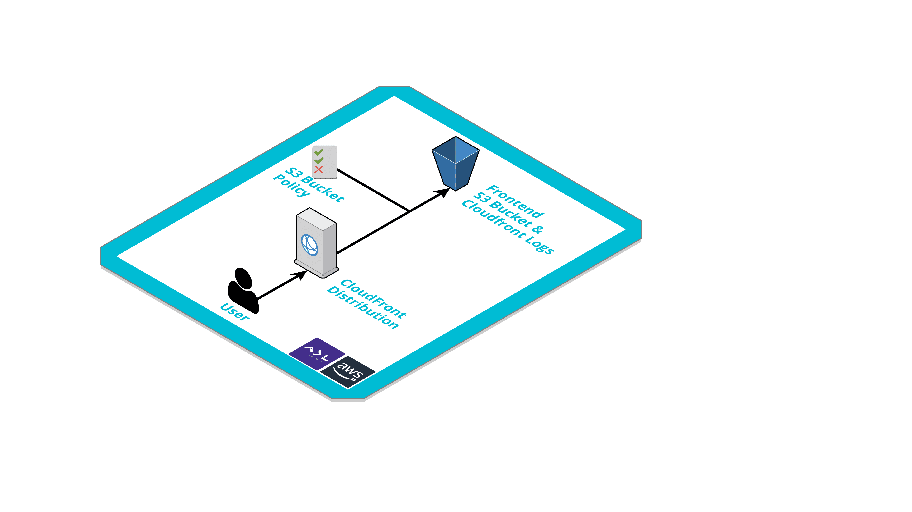
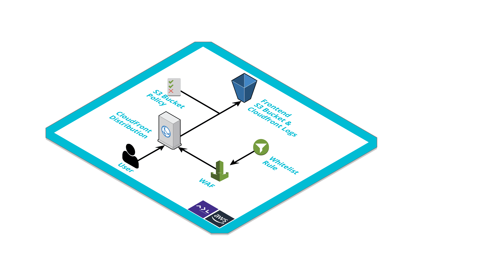
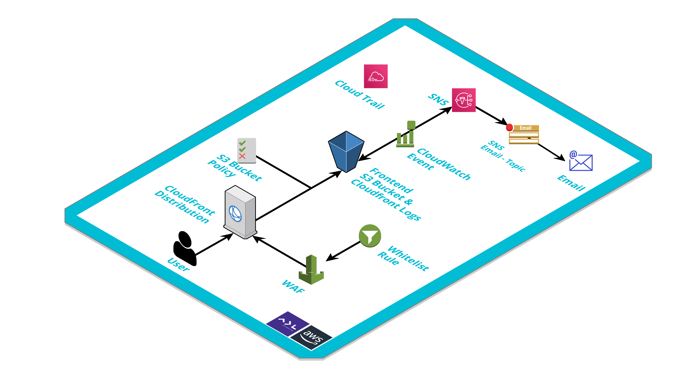

# Infra Test 🎉 🎉 🎉 :trollface:

La prueba técnica se compone de los siguientes 3 ejercicios/retos en donde se empleará Terraform Cloud como el orquestador en el workflow de terraform para el aprovisionamiento de infraestructura con base en una arquitectura definida! 👌 

Dicha arquitectura es el requerimiento de un proyecto de ADL que siempre estará en nuestro ❤️!

`Antes de iniciar con los retos, recomendamos revisar detenidamente la estructura y contenido del repositorio actual` 😈 :octocat: 

## Reto 1 :suspect:

* Como se ilustra en el diagrama, se requiere exponer contenido estático alojado en un bucket de S3 por medio de un Cloudfront. Los recursos declarados en el presente repositorio ya han sido aprovisionados correctamente. Sin embargo, el proyecto reporta que existe un error al momento de visualizar dichos archivos por medio de un navegador.

      Su objetivo es realizar lo debidamente necesario para que dichos archivos puedan ser visualizados mediante la distribución Cloudfront. 👊

## Reto 2 :rage1:

* Los super DevSecOps! 💂 han solicitado que que por temas de seguridad el WAF asociado a la distribución Cloudfront permita el acceso solo desde una IP específica (IP del Laboratorio) y no desde todo internet `0.0.0.0/0` 
  
      Su objetivo es ajustar las reglas del WAF asociado al Cloudfront de tal forma que se permita el acceso solo desde la IP del laboratorio. 💂💂 🚓 

## Reto 3 :feelsgood:

* Finalmente!! Se requiere tener cierto control sobre la carga de archivos en el path `/assets/`  del Bucket de S3, de tal forma que cada vez que ocurra un evento de escritura en los objetos del Bucket y en ese Path, se notifique por correo electrónico! 🏊🏊🏊

      Su objetivo es aprovisionar los recursos necesarios para atender el requerimiento basado en el siguiente diagrama:

## Importante !!!

* Hacer uso de Gitmojis para los mensajes de commit! Ej: `":sparkles: Actualizar políticas de acceso a Bucket S3"` https://gitmoji.avaldigitallabs.com/
* Ajustar el README cada vez que sea necesario!
* [Tener a la mano tanto la documentación de AWS como de Terraform!](https://www.terraform.io/docs/providers/aws/index.html)
    